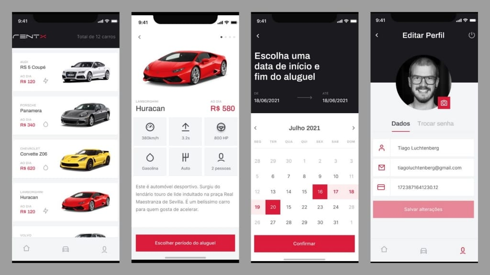

<h1 align="center">🚗 Rentx</h1>
<p align="center" id="objetivo">Project made during Ignite that consists of a mobile application where the user can create an account, see the profile, rent a car and see the appointments made.</p>

<div align="center" gap="10px">
  
  
  
</div>

<h1 align="center">
    <a href="https://reactnative.dev/">  React Native</a>
</h1>
<p align="center">🚀 React Native combines the best parts of native development with React, a best-in-class JavaScript library for building user interfaces.</p>

<p align="center">
 <a href="#layout">Layout</a> •
 <a href="#features">Features</a> •
 <a href="#roadmap">How it works</a> • 
 <a href="#tecnologias">Tech Stack</a> • 
 <a href="#author">Author</a>
</p>

<h4 align="center"> 
	🚧  React Native App 🚀 Finished  🚧
</h4>

### Layout

Figma: https://www.figma.com/file/e8Kkb8QImQV0Z0F8WXkgju/RentX-Ignite---Offline-First?node-id=0%3A1

<div style='margin: 20px' id="layout">
  <h1 align="center">
    
  </h1>
</div>

### Features

<div id="features">

- [x] 01 - Interface: Screens, Input email, Input password, accessibility, forms, forms validation. Images: Svg, themes.
- [x] 02 - Consuming API with JsonServer and axios. Passing data between screens, creating calendar, listing cars and creating appointments.
- [x] 03 - Animation with React Reanimated, splash screen and animation with lottie.
- [x] 04 - Auth, navigation with BottomTab and private routes.
- [x] 05 - Offline First: configuration of WatermelonDB, fast image loading. It is possible to save the profile and get the latest update of the cars when online.

</div>

<div id="roadmap">

### Pre-requisites

Before you begin, you will need to have the following tools installed on your machine:
[Git](https://git-scm.com), [Node.js](https://nodejs.org/en/).
In addition, it is good to have an editor to work with the code like [VSCode](https://code.visualstudio.com/)

### 🎲 Running the mobile application (FrontEnd)

```bash
# Clone this repository
$ git clone https://github.com/danhenriquex/Rocketseat-Ignite-Native-Rentx.git

# Access the project folder in your terminal/cmd
$ cd Rocketseat-Ignite-Native-Rentx

# Install the dependencies
$ yarn install

# Run the application in development mode
$ yarn react-native start
$ yarn react-native run-android


```
### Running the mobile application (BackEnd)
	
```bash
	
# Clone this repository
$ git clone https://github.com/rodrigorgtic/rentx-api-ignite

# Access the project folder in your terminal/cmd
$ cd rentx-api-ignite

# Install the dependencies
$ yarn install

# Run the application in development mode
$ yarn start
```


</div>

<div id="tecnologias">

### 🛠 Tech Stack

The following tools were used in the construction of the project:

- [Expo](https://expo.io/)
- [Node.js](https://nodejs.org/en/)
- [React](https://pt-br.reactjs.org/)
- [React Native](https://reactnative.dev/)
- [WatermelonDB](https://nozbe.github.io/WatermelonDB/Installation.html)
- [TypeScript](https://www.typescriptlang.org/)
- [Calendar](https://github.com/wix/react-native-calendars)
- [Fast Image](https://github.com/DylanVann/react-native-fast-image)
</div>

### Author

---

<!-- <script type="text/javascript" src="https://platform.linkedin.com/badges/js/profile.js" async defer></script> -->

<div align="left" id="author">

<a href="https://github.com/danhenriquex">
  
</a>

<!-- <div class="LI-profile-badge"  data-version="v1" data-size="medium" data-locale="pt_BR" data-type="vertical" data-theme="dark" data-vanity="danilo-henrique-santana"><a class="LI-simple-link" href='https://br.linkedin.com/in/danilo-henrique-santana?trk=profile-badge'>Danilo Henrique</a></div> -->
</div>

<div style="margin-top: 20px" >
  <a href="https://www.linkedin.com/in/danilo-henrique-480032167/">
    
  </a>
</div>
